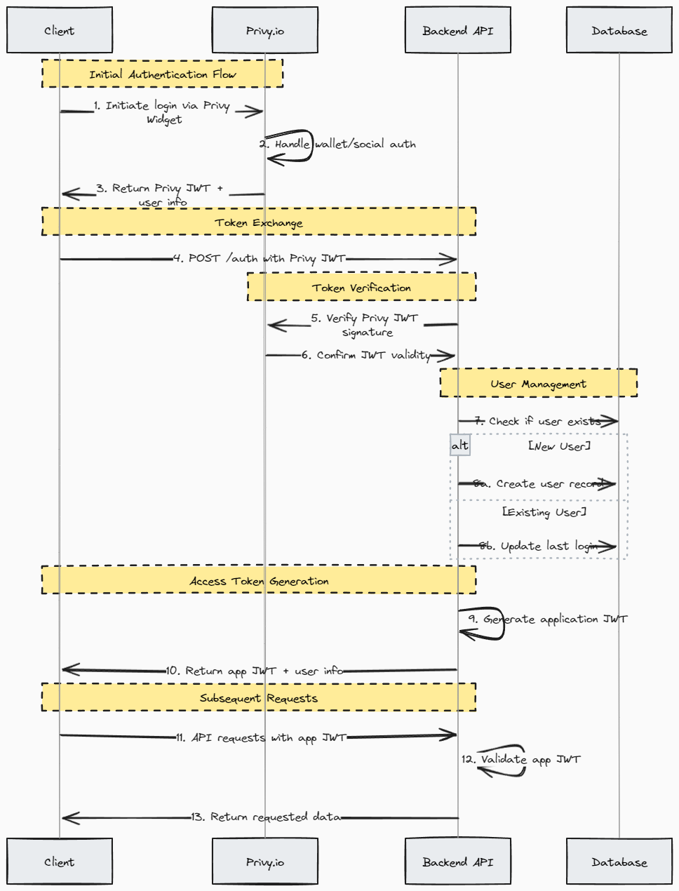

# Personal Asset Manager Dashboard

A robust backend service for managing digital assets (ERC-20 and ERC-721 tokens) with real-time portfolio tracking and analytics.

## Authentication Flow


## Features

- 🔐 Secure authentication using Privy.io
- 💰 ERC-20 and ERC-721 token management
- 📊 Real-time portfolio tracking
- 📈 Daily price updates
- 📉 PnL calculations
- 🔄 Automated CI/CD pipeline

## Tech Stack

- NestJS with TypeScript
- PostgreSQL with Kysely
- Docker & Docker Compose
- Privy.io Authentication
- GitHub Actions for CI/CD

## Prerequisites

- Node.js (v18+)
- Docker and Docker Compose
- PostgreSQL 14
- Privy.io account and API credentials

## Getting Started

1. Clone the repository:
```bash
git clone https://github.com/your-username/personal-asset-manager.git
cd personal-asset-manager
```

2. Install dependencies:
```bash
npm install
```

3. Set up environment variables:
```bash
cp .env.example .env
# Edit .env with your configurations
```

4. Start the database:
```bash
npm run docker:up
```

5. Run migrations:
```bash
npm run migration:latest
```

6. Start the development server:
```bash
npm run start:dev
```

## API Documentation

Once the server is running, access the Swagger documentation at:
```
http://localhost:3000/api
```

## Available Endpoints

### Authentication
- `POST /auth` - Exchange Privy.io JWT for application token

### Assets
- `POST /assets` - Create new asset
- `GET /assets` - List all assets
- `GET /assets/:id` - Get specific asset
- `DELETE /assets/:id` - Remove asset
- `GET /assets/:id/history` - Get asset price history

### Portfolio
- `GET /portfolio/value` - Get current portfolio value
- `GET /portfolio/analytics` - Get portfolio analytics

## Database Migrations

Create a new migration:
```bash
npm run migration:create your-migration-name
```

Run migrations:
```bash
npm run migration:latest
```

## Development

Start the development server:
```bash
npm run start:dev
```

Run linting:
```bash
npm run lint
```

Run tests:
```bash
npm test
```

## Docker Support

Build and run with Docker:
```bash
# Build images
docker-compose build

# Start services
docker-compose up -d

# Stop services
docker-compose down
```

## CI/CD Pipeline

The project uses GitHub Actions for CI/CD with the following stages:

1. **Validation**
   - Package lock file verification
   - ESLint checks
   - TypeScript compilation
   - Build verification

2. **Testing**
   - Unit tests
   - Integration tests (with PostgreSQL service container)

3. **Deployment** (on main branch)
   - Docker image build
   - Push to container registry
   - Deployment to target environment

## Project Structure

```
├── src/
│   ├── auth/           # Authentication module
│   ├── assets/         # Asset management
│   ├── portfolio/      # Portfolio analytics
│   ├── prices/         # Price updates
│   ├── database/       # Database configuration
│   └── main.ts         # Application entry point
├── test/               # Test files
├── docker/             # Docker configurations
├── .github/            # GitHub Actions
└── docs/              # Documentation
```

## Contributing

1. Create a feature branch
2. Make your changes
3. Run tests and linting
4. Submit a pull request

## License

[MIT](LICENSE)